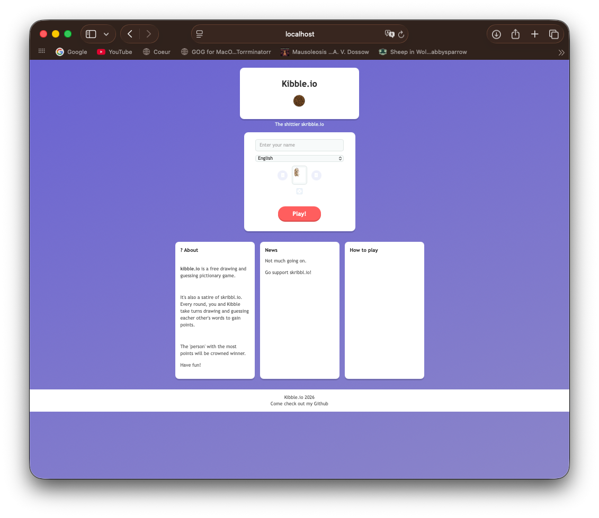
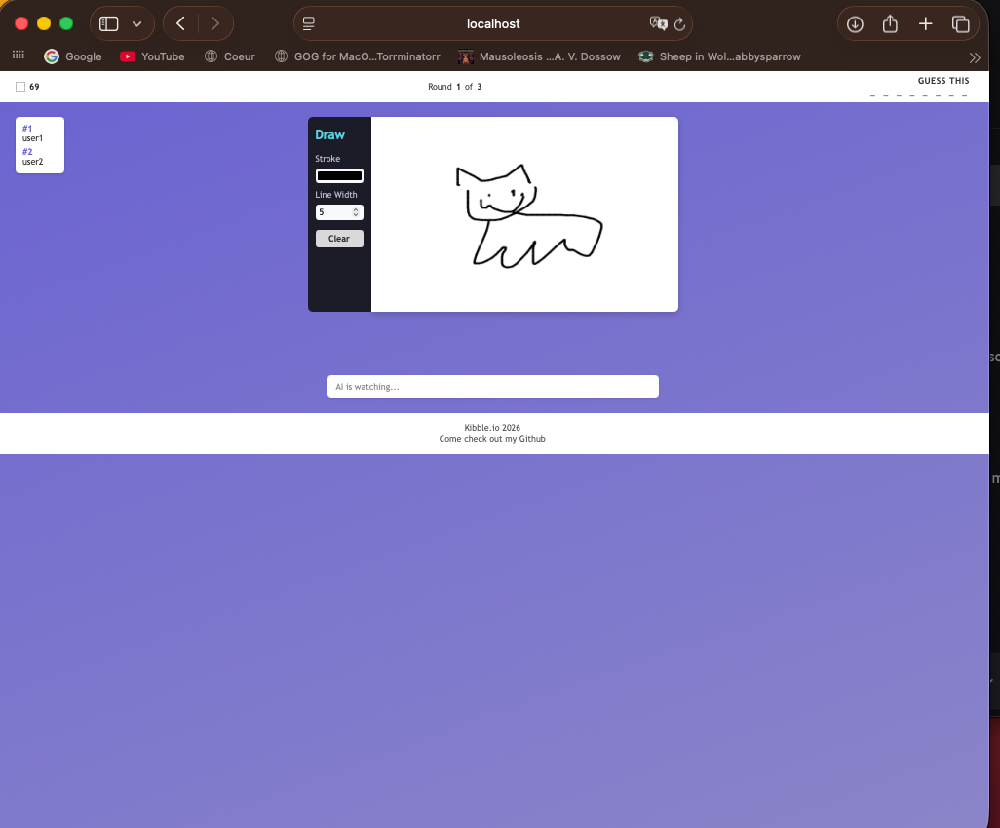
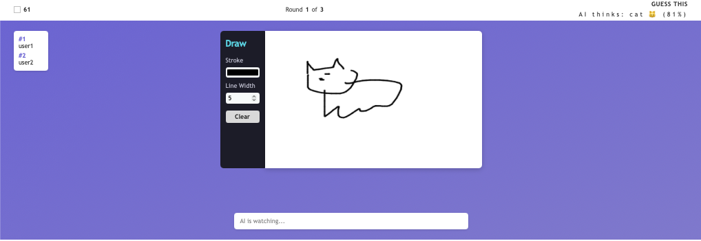

# Kibble.io
##  What this project is
Inpspired by the beloved : <a href="https://skribbl.io">Skribbl.io</a> I built a copycat website that resembled skribbl io but it's a play on dogs and kibble (ahaha get it). It's still a multiplayer drawing guessing game, through the multiplayer sever and canvas updates with Node.js. There's also an AI guesser with a tensorflow model trained off the <a href="https://console.cloud.google.com/storage/browser/quickdraw_dataset/full/numpy_bitmap;tab=objects?pli=1&prefix=&forceOnObjectsSortingFiltering=false"> Google Quick Draw API Data</a>. I took a small subsection of the dataset to train my model with prediction percentages. 

NOTE TO THE REVIEWERS: i want to apologize in advance to reviwers for my <a href="How I made this project">lapses</a>. THere are some parts that are me texting my friends, etc and not coding; I'm aware of them, but unable to cut them out with the new Lapse version (whcih removed cutting) nor unsync them from my project. I totally understand if you have to cut hours! I'm just trying to pay back my 19 hours of debt :')

<video src="public/assets/demo-video.mov">

---

## How to run this

## Why I made this project
Practicing node and tensorflow while learning something new

## How I made this project

Node js tutorials to figure out how to dyanically update website and make multiplayer work (as seen by my <a href="What this project is">node-and-js time</a>)
I had to familiarize myself with pillow and keras through tutorials to work the tensorflow work

---

## Challenges I faced
I had originally planned to import the entire quickdraw dataset, bbut qucikly realized that would be way too big to store locally. I also wanted to use google quickdraw API but had trouble making it work; if I were to update this project, that would be my next step: so my AI guesses would be way more expansive.
Theoretically this SHOULD be multiplayer and update dynamically as other players draw on the website canvas, but currently a large part of the website consists of placeholders. I would expand the multiplayer sever handling and try to introduce round mechanics in between players, and add a set array of word choices to draw from as I import my training datasets.
I'm really bad at CSS styling so it was a challenge to try and get it to look the way I want to, and I had to consult <a href="https://www.google.com/url?sa=t&source=web&rct=j&opi=89978449&url=https://www.w3schools.com/cssref/index.php&ved=2ahUKEwjplPTE-MuVAxXJEFkFHVBINiMQFnoECBoQAQ&usg=AOvVaw3fflWIvatc74KTRxjKN5Cv">W3 documentation </a> often.

##AI Declaration
ChatGPT and Claude was used to debug code when I got stuck.